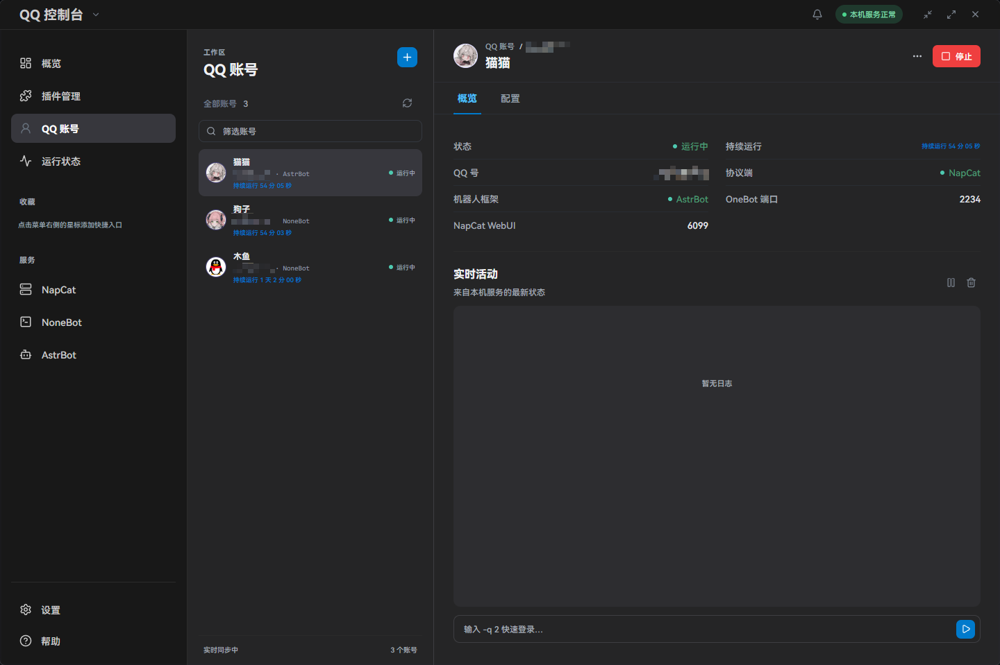
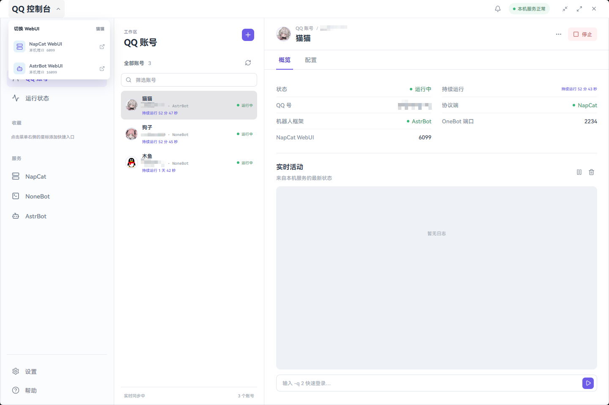
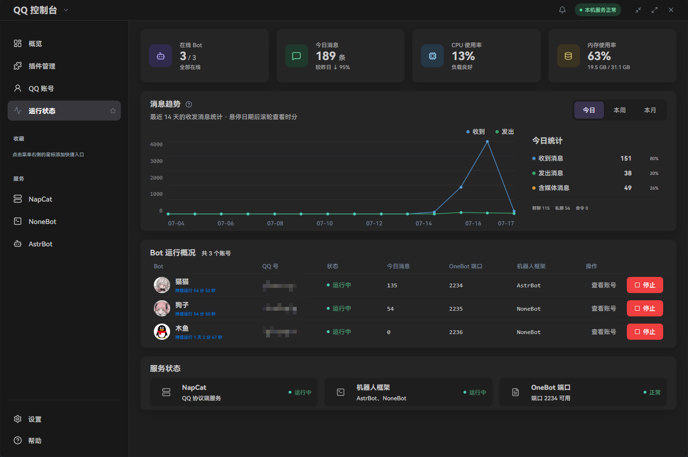

# QQBot Desktop Launcher

QQBot Desktop Launcher 是一个面向 Windows 的个人本地 QQ Bot 快速启动与管理项目。它属于个人维护的本地 Windows UI 项目，桌面界面基于 Electron + Chromium，不是云端 SaaS，也不是原生 WinUI 框架。

程序运行在用户自己的 Windows 电脑上，负责启动和管理本机的 QQ 协议端、机器人框架、账号配置和运行日志。

当前主要组合为：

- NapCat：QQ 协议端
- NoneBot：主要机器人框架
- AstrBot：可选机器人框架

后续可以继续接入其他协议端或机器人框架。

## 界面预览

### 深色与浅色主题

| 深色主题 | 浅色主题 |
| --- | --- |
|  |  |

### 运行状态与管理界面



## 主要功能

- Windows 桌面端快速启动和关闭本地管理服务
- 管理多个 QQ 账号及各自的 OneBot、NapCat WebUI 端口
- 启动、停止和查看 Bot 运行状态
- 实时查看当前运行日志、登录二维码和安全验证信息
- 在 NapCat WebUI、AstrBot WebUI 之间切换
- 选择或一键配置 NoneBot、AstrBot 和 NapCat 运行资源
- 管理 NoneBot 与 AstrBot 的插件信息
- 支持浅色、深色和系统主题，以及主题插件包
- 账号、日志、资源路径和运行配置保存在本机

NapCat 是 QQ 协议端，NoneBot 和 AstrBot 是机器人框架。一个 QQ 账号应选择一个机器人框架，NapCat 负责连接 QQ，框架负责消息处理和插件运行。

## 本地部署

### 环境要求

- Windows 10 或更高版本
- Python 3.12
- Node.js 24
- PowerShell 5.1 或 PowerShell 7

QQ、NapCat、NoneBot 和 AstrBot 属于独立的第三方运行资源。首次启动后，可以在控制台的资源配置页面选择本机已有目录，或使用一键配置向导获取资源。

### 安装开发依赖

在项目根目录执行：

```powershell
python -m venv .venv
.\.venv\Scripts\python.exe -m pip install -e ".[dev]"
npm --prefix admin\frontend ci
npm --prefix admin\desktop ci
```

### 启动桌面端

推荐直接运行：

```powershell
.\start-desktop.ps1
```

脚本会构建前端并启动 Electron 桌面端。桌面端会启动本地 FastAPI 管理服务，再加载 React 管理面板。

也可以手动启动桌面端：

```powershell
cd admin\desktop
npm run desktop
```

### 单独启动管理 API

如果只需要调试后端：

```powershell
cd admin
..\.venv\Scripts\python.exe server.py
```

默认管理 API 地址为 `http://127.0.0.1:6700`。桌面端会为当前会话生成本地访问 Token，不建议把 Token 写入代码、日志或提交到 Git。

## 首次配置

1. 启动桌面端并进入资源配置页面。
2. 为 NapCat、NoneBot 或 AstrBot 选择本机目录，或使用一键配置。
3. 进入“QQ 账号”，创建账号并填写 QQ 号、OneBot 端口和可选的 NapCat WebUI 端口。
4. 选择该账号使用的机器人框架。
5. 点击启动，根据日志中的二维码或安全验证完成登录。

资源配置完成后，路径会保存在本机 `data/admin/resources.json`，账号数据库默认位于 `data/admin/bots.db`。这些文件属于本地运行数据，不应上传到 Git。

## Windows 打包

先完成开发依赖安装，然后执行：

```powershell
cd admin\desktop
npm run dist:win
```

打包流程会：

1. 构建 React 管理面板。
2. 使用 PyInstaller 构建 FastAPI 管理服务。
3. 准备 Python 运行时。
4. 使用 electron-builder 生成 Portable 和 NSIS 安装包。

产物位于项目根目录的 `release/`：

- `QQBot-Desktop-Launcher-Portable.exe`
- `QQBot-Desktop-Launcher-Setup.exe`

打包程序只包含桌面端、管理服务和 Python 运行时。NapCat、NoneBot、AstrBot 等第三方资源会在用户首次配置时单独选择或下载，不会被提交到仓库。

## 项目结构

```text
.
├── admin/
│   ├── backend/       FastAPI 管理服务、账号管理、进程和资源配置
│   ├── frontend/      React/Vite 管理界面
│   └── desktop/       Electron 桌面宿主和 Windows 打包配置
├── docs/images/       项目界面截图
├── scripts/            验证与 Windows 后端打包脚本
├── data/               本地数据库、配置和日志，运行时生成
├── program/            NapCat、NoneBot、AstrBot 等运行资源，运行时生成
└── release/            Windows 打包产物，运行时生成
```

## 环境变量

常用环境变量如下：

| 变量 | 用途 | 默认值 |
| --- | --- | --- |
| `QQ_BOT_ROOT` | 指定项目或本地运行数据根目录 | 当前项目根目录 |
| `QQ_CONSOLE_HOST` | 管理 API 监听地址 | `127.0.0.1` |
| `QQ_CONSOLE_PORT` | 管理 API 端口 | `6700` |
| `NAPCAT_DIR` | 指定 NapCat 启动目录 | `program\NapCat` |
| `QQ_BOT_PYTHON` | 指定创建 Bot 虚拟环境时使用的 Python | 当前 Python |

默认只监听本机回环地址，不建议直接暴露管理 API 到局域网或公网。

## 开发检查

完整验证命令：

```powershell
.\scripts\verify.ps1
```

该命令会检查 Python 代码、前端 lint、类型检查、前端测试、生产构建和 Electron 文件。测试文件只在本地开发环境存在时执行，发布仓库不依赖测试文件才能完成基础验证。

## 数据与隐私

- QQ 账号配置、密码回退配置、日志和资源路径只保存在本机数据目录。
- 管理 API 默认绑定 `127.0.0.1`，桌面端通过本地会话 Token 访问。
- 项目不会默认把 QQ 聊天消息上传到远程服务。
- `data/`、`program/`、`release/`、虚拟环境和密钥文件已加入 Git 排除规则。
- 不要提交 QQ 密码、NapCat Token、AstrBot 密码、Cookie 或其他个人凭据。

## 项目定位与限制

这是一个个人维护的 Windows 本地 UI 项目，当前优先服务本地部署和个人使用场景。第三方协议端、机器人框架、登录流程和签名服务由各自项目维护，版本变化可能影响下载、登录或启动结果。

项目许可证见 [LICENSE](LICENSE)。
